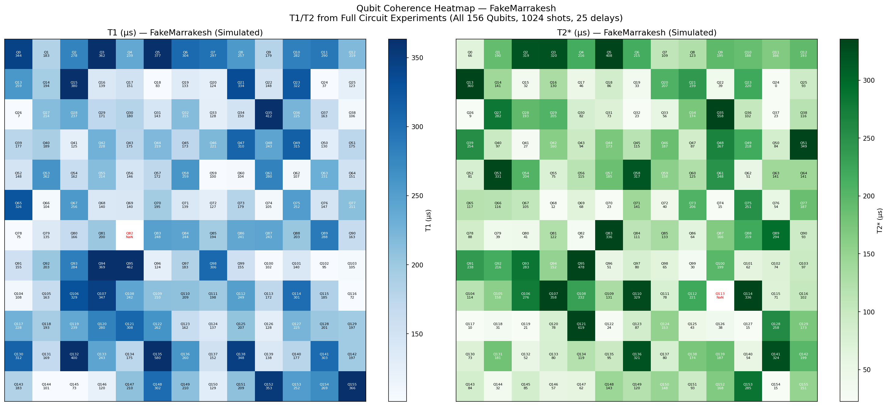
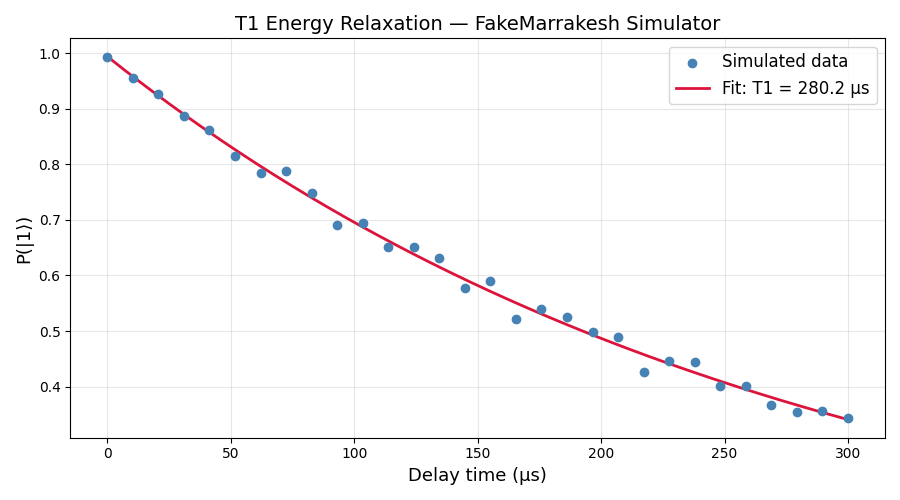
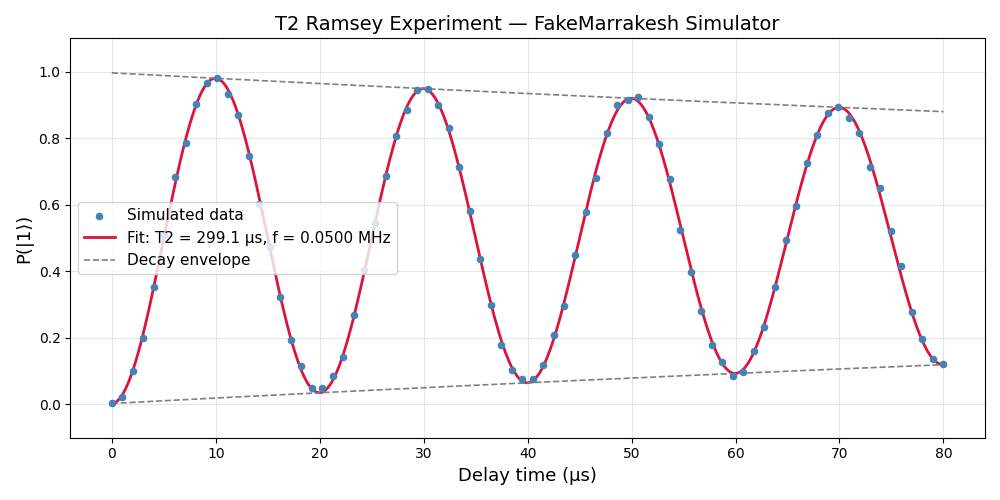
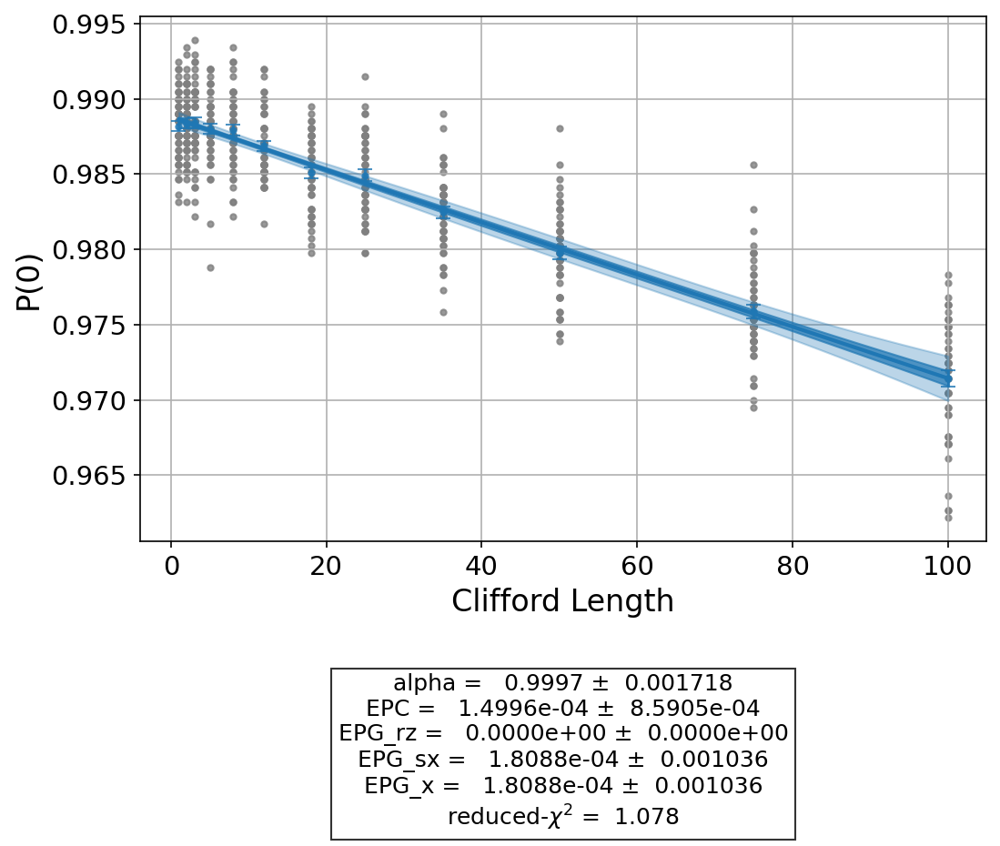
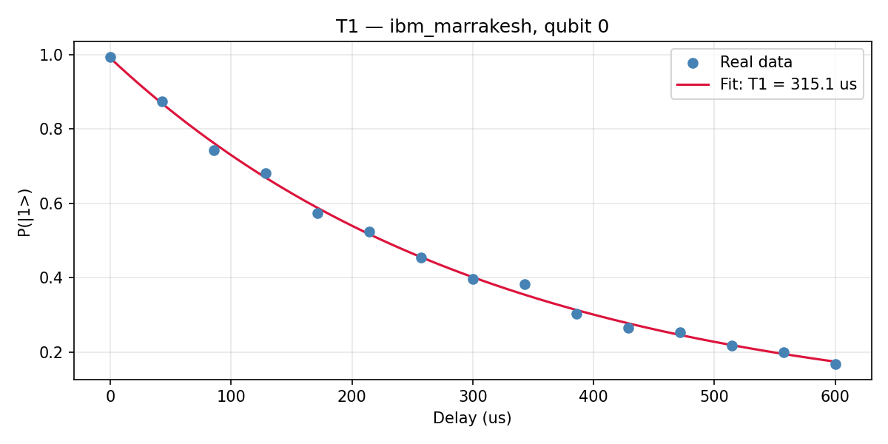

# IBM Quantum: Coherence Characterization — T1, T2, and Randomized Benchmarking

**Author:** Paulino "Paul" Gin · BS Applied Physics + BA Mathematics, Boston College (Class of 2027)
**Stack:** Qiskit · qiskit-experiments · qiskit-ibm-runtime · Python (NumPy / SciPy / Matplotlib / Pandas)
**Repo:** [github.com/paulggin/ibm-quantum-coherence-characterization](https://github.com/paulggin/ibm-quantum-coherence-characterization)

---

## Overview

This project characterizes superconducting transmon qubits on IBM Quantum hardware using the three measurements: **T1 (energy relaxation)**, **T2 Ramsey (dephasing)**, and **randomized benchmarking (gate fidelity)**. The project is divided into two parts. First, T1, T2, and randomized benchmarking (RB) measurements were conducted on a single qubit using `FakeMarrakesh`, which emulates the `ibm_marrakesh` Heron r2 device using IBM’s published calibration data. This ultimately scaled to a full 156-qubit characterization of the `FakeMarrakesh` simulator. Second, a 4-qubit characterization was carried out on `ibm_marrakesh`, the real IBM Runtime backend, to validate the methodology against real device noise and compare qubit characterization results across the hardware.

The deliverable is a full characterization procedure that covers everything from building and transpiling circuits to running experiments, fitting exponential and oscillating decay curves, filtering outliers, and visualizing large-scale results.

---

## Background

A superconducting transmon qubit is a quantum two-level system at millikelvin temperatures whose computational lifetime is determined by two coherence times:

- **T1** is the *energy relaxation time*: how long the qubit holds its excited state |1⟩ before losing energy to the environment and decaying to ground state |0⟩. On the Bloch sphere, T1 describes the population's decay toward the north pole over time.
- **T2** is the *coherence (dephasing) time*: how long the qubit holds a definite phase in superposition before environmental noise randomizes it. It is bounded by 2 · T1, with additional pure-dephasing channels shortening it further: 1/T2 = 1/(2·T1) + 1/T_φ.

These two numbers, together with single-qubit gate fidelity, measured via RB, set the practical depth limit for any algorithm running on the device. For example, a T2 of 100 µs with a 200 ns two-qubit gate gives at most ~500 gates of coherent operation.

---

## Methods

### Code architecture

Circuit definitions and fit functions are located in `experiments/circuits.py` as the primary source. Both the fake-backend validation scripts and the real-hardware anchor import from there, so the experiment definition cannot drift between simulator and real-device runs. The idea behind the FakeMarrakesh runs is to first validate everything on the simulator, then deploy the same setup directly to real hardware. Only the execution wrapper (`AerSimulator.from_backend(...)` vs. `SamplerV2(mode=backend)`) differs. 

### Backends

- **FakeMarrakesh** (`qiskit_ibm_runtime.fake_provider.FakeMarrakesh`) — 156-qubit Heron r2 simulator that replays IBM's published calibration data. Used for the full multi-qubit characterization.
- **FakeNairobi** — 7-qubit Eagle r1 simulator. Used as a cross-backend RB small scale sanity check.
- **Real IBM Runtime backend** — `experiments/real_hardware_anchor.py` runs qubit characterization directly on `ibm_marrakesh` via IBM Runtime.

### Single-qubit T1

For each delay τ in a sweep from 0 to 300 µs (300 µs for `FakeMarrakesh`; up to 600 µs for the real-hardware anchor):

1. Apply an X gate to set |1⟩.
2. Delay for τ.
3. Measure.

P(|1⟩) is fit to an exponential decay A · exp(−τ / T1) + C using `scipy.optimize.curve_fit` with physical bounds to ensure the fitted amplitude, offset, and decay constant remain within valid ranges consistent with qubit behavior.

### Single-qubit T2 Ramsey

For each delay τ in a sweep from 0 to 80–100 µs:

1. Apply H to put the qubit on the equator.
2. Delay for τ.
3. Apply Rz(2π · f_detune · τ) to force a detuning that produces visible oscillations.
4. Apply H again to convert phase into population.
5. Measure.

The fit is A · exp(−τ / T2) · cos(2π f τ + φ) + C. To avoid local minima, the initial frequency guess comes from an FFT of the residual after mean subtraction — `np.fft.rfft(probs − mean(probs))` — and the dominant component seeds the curve fit.

### Randomized benchmarking

`qiskit_experiments.library.StandardRB` with single-qubit Clifford sequences. The FakeMarrakesh run uses 12 sequence lengths and 50 random samples per length; the real-hardware anchor uses 6 lengths to fit Open Plan budget while retaining 50 samples. EPC (error per Clifford) and gate fidelity are extracted from the exponential survival-probability decay.

### Multi-qubit coherence map

`multiqubit_heatmap_marrakesh.py` runs the `qiskit_experiments.library.T1` and `T2Ramsey` primitives on all 156 FakeMarrakesh qubits with checkpointed CSV writes every 10 qubits. Fitting failures (negative T1, T2 > 2 s, etc.) are masked at analysis time via `heatmap_csv_fix.py` (T1 ≤ 0 or > 2000 µs → NaN; T2 ≤ 0 or > 2000 µs → NaN).

---

## Debugging Notes

The T2 Ramsey curve fit initially converged to local minima under a generic damped-cosine model — the oscillation frequency is the parameter most sensitive to a bad initial guess. Fixed by seeding the nonlinear fit from an FFT of the raw data: the FFT peak frequency gives a reliable starting point, and every run converges cleanly on the first try after that.

The 156-qubit coherence sweep produced a handful of unphysical fits on the first pass — 3 of 156 qubits returned negative or implausibly large T1/T2 values where the underlying calibration data was too thin to constrain the fit. Applied a sanity filter (T1, T2 ∈ (0, 2000] µs) to mask those out rather than silently averaging them in. Headline numbers on the valid 153/156 qubits: T1 mean 211.7 µs (median 200.5 µs), T2 mean 149.8 µs (median 122.1 µs).

## Results

### Multi-qubit FakeMarrakesh characterization (156 qubits)

| Metric | Value |
| :-- | :-- |
| Qubits with valid fits | **153 / 156** |
| Failed fits (masked) | Q24, Q82, Q113 |
| T1 mean (valid) | **211.7 µs** (median 200.5 µs) |
| T1 range | 6.9 – 579.9 µs |
| T2* mean (valid) | **149.8 µs** (median 122.1 µs) |
| T2* range | 8.9 – 619.2 µs |
| T2 > 2·T1 violations | 0 (after masking) |



The heatmap shows spatial variation in coherence across the chip. Most qubits sit in the 100–300 µs T1 range typical of Heron r2 devices. The three masked qubits (Q24, Q82, Q113) represent fit failures rather than physical outliers; the qiskit-experiments primitive returned degenerate solutions for these specific sweeps.

### Single-qubit anchor — FakeMarrakesh

T1 fit on qubit 0:



T2 Ramsey on qubit 0 (with deliberate 0.05 MHz detuning for visible oscillations):



### Randomized benchmarking

| Backend | EPC | Gate Fidelity |
| :-- | :-- | :-- |
| FakeNairobi (Eagle r1, 7 qubits) | 7.900 × 10⁻⁴ | 99.9210% |

See `plots/rb_fakemarrakesh.png` for the FakeMarrakesh RB decay curve.



### Real-hardware anchor — `ibm_marrakesh`, qubit 0

Run on 2026-05-16 via IBM Runtime. Each qubit gets one batched SamplerV2 job for T1 + T2, followed by `StandardRB` (50 samples × 6 sequence lengths up to 300 Cliffords) for gate fidelity.

| Qubit | T1 meas (µs) | T1 pub (µs) | T2 meas (µs) | T2 pub (µs) | EPC | Gate fidelity |
| :-- | --: | --: | --: | --: | --: | --: |
| Q0 | **315.1** | 344.5 | **46.1** | 49.1 | 6.46 × 10⁻⁴ | **99.94%** |
| Q1 | 194.6 | 138.8 | 125.1 | 116.8 | 17.25 × 10⁻⁴ | 99.83% |
| Q2 | 323.0 | 228.5 | 221.1 | 83.5 | 11.62 × 10⁻⁴ | 99.88% |
| Q3 | 296.6 | 271.7 | 208.1 | 144.6 | 13.55 × 10⁻⁴ | 99.86% |

Full per-qubit data, metadata, and job IDs in `data/real_hardware/`. Aggregate summary: `data/real_hardware/ibm_marrakesh_4qubit_summary.csv`.




**Observations.**

Single-qubit gate fidelities sit in the 99.83–99.94% band, which is consistent with published Heron r2 specifications. T1 and T2 measurements drift from the published values by a wider margin than the gate fidelity (Q1 T1 +40%, Q2 T2 +165%). This is expected: IBM's calibration data is refreshed on a slow cadence, and individual qubit coherence times drift hourly as two-level-system defects activate and deactivate in the dielectric and as charge-noise environments evolve. The published values are a snapshot, not a guarantee.

**The most interesting physical observation is on Q0.** Across the four qubits, T2 sits at different fractions of the 2·T1 ceiling, with Q0 the outlier. This finding is reinforced by the short-timescale stability check:

| Qubit | T2 / (2·T1) | T_φ (µs) | Regime |
| :-- | --: | --: | :-- |
| Q0 | **0.073** | **49.7** | T_φ-limited — T2 budget is almost entirely pure dephasing |
| Q1 | 0.322 | 162.7 | Both amplitude damping and dephasing contribute |
| Q2 | 0.342 | 396.5 | Amplitude-damping-limited |
| Q3 | 0.351 | 343.0 | Amplitude-damping-limited |

T_φ extracted from 1/T2 = 1/(2·T1) + 1/T_φ. Q0's phase-randomizing noise (quasi-static or 1/f) dominates its decoherence, not energy loss to the environment. The mitigation to this uses Hahn-echo and CPMG dynamical decoupling,  refocusing pulse sequences that periodically flip the qubit's phase evolution to cancel accumulated dephasing errors, to suppress dephasing, extending Q0’s effective T2 toward approximately 2·T1 (~630 µs), while leaving T1 unchanged. Q1–Q3 would benefit much less from echo sequences because they are already close to the amplitude-damping ceiling.

**Temporal Stability Study - Q0 repeated trial.** Q0 was re-measured 22 minutes after the initial run under identical conditions to probe short-timescale drift.

| Qubit (Time) | T1 (µs) | T2 (µs) | Gate Fidelity (%) | EPC |
| :-- | --: | --: | --: | --: |
| Q0 (20:45 UTC) | 318.9 | 43.1 | 99.89 | 0.0011 ± 0.0003 |
| Q0 (21:07 UTC) | 315.1 | 46.1 | 99.94 | 0.0006 ± 0.0004 |

T1 remains stable within 1.2% over 22 minutes, consistent with fixed amplitude-damping behavior arising from energy relaxation mechanisms. T2 varies by about 7.0%, indicating sensitivity to low-frequency dephasing noise rather than hardware drift. Gate fidelity is essentially unchanged (99.89% to 99.94%), while EPC improves (0.0011 to 0.0006), suggesting that short-timescale variation is dominated by stochastic phase noise rather than control degradation. Overall, the noise is split: T1 sets a stable amplitude-damping floor and T2 carries the time-varying dephasing component, with Q0 showing the strongest sensitivity to it.

---

## Discussion

**Why measured T1 may differ from backend-published values.** IBM publishes calibration data updated on a roughly daily cadence. Between calibrations, qubit coherence drifts due to two-level-system (TLS) defects activating and deactivating in the dielectric, slow charge-noise fluctuations, and Purcell decay into readout resonators. Differences of 10–30% between a fresh measurement and the published value are common and expected. Differences much larger than that are usually signs of fit failure rather than hardware drift.

**Why T2 < 2·T1 must hold.** Any energy-relaxation event randomizes phase, so the dephasing rate 1/T2 always includes a contribution of 1/(2·T1) from amplitude damping. Pure dephasing T_φ adds to that: 1/T2 = 1/(2·T1) + 1/T_φ. A measured T2 > 2·T1 is unphysical and indicates the fit landed in a bad local minimum usually because the data is too noisy, the sweep range is wrong relative to the actual coherence time, or the oscillation frequency in the Ramsey fit was misestimated. The solution here uses an FFT-seeded initial guess for the Ramsey frequency precisely to avoid that failure.

**Why qubits on the same chip have different coherence times.** Fabrication variation in junction area and oxide thickness produces small differences in transmon parameters (E_J / E_C ratio, frequency, anharmonicity). Each qubit also sees a different local microwave environment, has different proximity to TLS defects, and has different Purcell coupling to its readout resonator. The 6.9 – 579.9 µs T1 range observed on FakeMarrakesh reflects this kind of qubit-to-qubit variation, which is why hardware engineering teams characterize every qubit on a chip rather than relying on a chip-average number.

---

## Repository layout

```
experiments/
  circuits.py                       canonical t1_circuit, t2_ramsey_circuit, exp_decay, ramsey_decay
  t1_fakemarrakesh.py               single-qubit T1 on FakeMarrakesh
  t2_fakemarrakesh.py               single-qubit T2 Ramsey on FakeMarrakesh
  rb_fakenairobi.py                 RB on FakeNairobi (Eagle r1)
  rb_fakemarrakesh.py               RB on FakeMarrakesh (Heron r2)
  multiqubit_characterization.py    156-qubit T1 + T2 sweep with checkpointing
  real_hardware_anchor.py           T1 + T2 + RB on one qubit of a real IBM backend
analysis/
  mask_outliers.py                  physical-bounds mask for the 156-qubit CSV
  plot_coherence_heatmap.py         regenerate masked heatmap from the CSV
data/
  marrakesh_156qubit_coherence.csv  full 156-qubit FakeMarrakesh dataset
  real_hardware/                    per-qubit T1/T2/RB data + metadata for the real anchor
plots/                              final figures (see INVENTORY.md)
```

## How to reproduce

```bash
# 1. Install
pip install -r requirements.txt

# 2. Configure IBM Quantum credentials (one-time)
python -c "from qiskit_ibm_runtime import QiskitRuntimeService; QiskitRuntimeService.save_account(channel='ibm_quantum', token='<your_token>')"

# 3. Validate on simulator (no credentials needed)
python experiments/t1_fakemarrakesh.py
python experiments/t2_fakemarrakesh.py
python experiments/rb_fakemarrakesh.py
python experiments/multiqubit_characterization.py    # ~1-2 hr
python analysis/plot_coherence_heatmap.py

# 4. Anchor on real hardware
python experiments/real_hardware_anchor.py
```

## Development Notes

Built with AI assistance (Claude) for boilerplate, syntax lookup, and debugging. Architecture, algorithm choices, and physics/math implementation are my own. 
